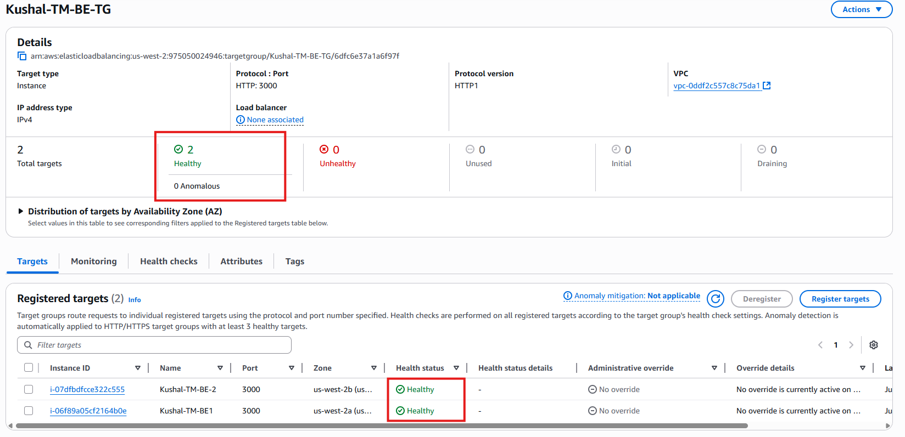
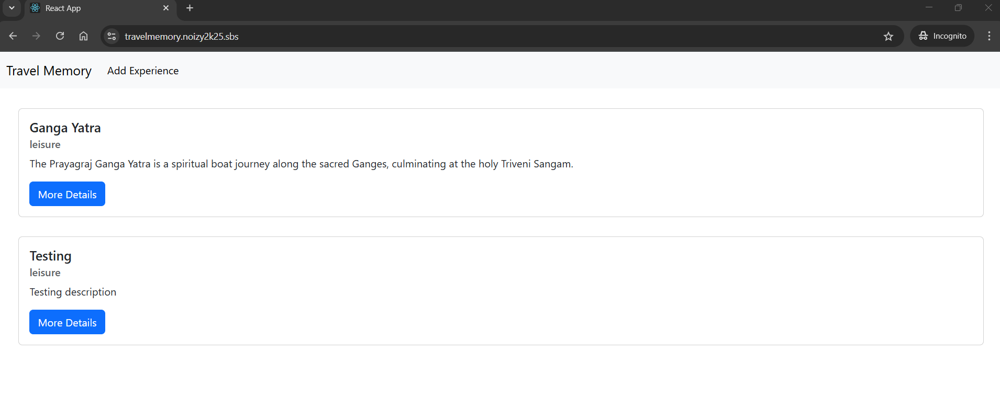

# 🚀 TravelMemory Application – AWS Deployment (MERN Stack)

## 📌 Objective

To deploy the full-stack TravelMemory application using AWS services with the following goals:
- Deploy frontend and backend on EC2 using the MERN stack
- Ensure secure and scalable access via Load Balancers
- Map frontend and backend to custom domains using Cloudflare
- Enable SSL encryption via AWS Certificate Manager (ACM)
- Store data in MongoDB Atlas securely
- Demonstrate load balancing and redundancy with AMIs and multi-AZ deployment

---

## 🛠️ Tech Stack & Services Used

- **Frontend**: React (served via Nginx)
- **Backend**: Node.js + Express (served via PM2)
- **Database**: MongoDB Atlas (cloud)
- **Hosting**: Amazon EC2 (Ubuntu)
- **Networking**: VPC, Subnets, Route Tables, NAT Gateway
- **Load Balancing**: AWS Application Load Balancer (ALB)
- **SSL**: AWS Certificate Manager
- **Domain Management**: Cloudflare
- **Scaling**: AMI-based multi-AZ EC2 instances

---

## 🧱 Architecture Diagram

<p align="center">
  
</p>

---

## ⚙️ Deployment Steps

### 🔹 1. Backend Setup

```bash
# SSH into backend EC2
git clone https://github.com/UnpredictablePrashant/TravelMemory.git
cd TravelMemory/backend

# Add .env file
nano .env

# Format:
MONGO_URI=<your-mongodb-atlas-uri>
PORT=3000

# Install dependencies and start server
npm install
pm2 start server.js
```
<br>

### 🔹 2. Frontend Setup
```
# SSH into frontend EC2
cd TravelMemory/frontend

# Update API base URL
# File: frontend/src/urls.js
export const baseUrl = "https://api.travelmemory.noizy2k25.sbs";

# Build React App
npm install
npm run build

```
> 📌 Note: Nginx serves static files from `build/` directory on port 80.

<br>

### 🔹 3. Load Balancers & ACM
- **Created two ALBs:** one for Frontend, one for Backend
- **Listener:** HTTPS (443)
- **ACM Certificates for:**
   - www.travelmemory.noizy2k25.sbs (FE)
   - api.travelmemory.noizy2k25.sbs (BE)

> 📌 Note: Each LB connected to its Target Group (EC2s from different AZs)

<br>

### 🔹 4. NAT & Routing
- Backend EC2 (private) required internet access
- Setup NAT Gateway in public subnet
- Updated private subnet route table with:
```
0.0.0.0/0 → NAT Gateway
```
<br>

### 🔹 5. Domain Mapping via Cloudflare
- **Cloudflare DNS setup:**

| Subdomain                        | Record Type | Target (LB DNS)      |
| -------------------------------- | ----------- | -------------------- |
| `www.travelmemory.noizy2k25.sbs` | CNAME       | FE Load Balancer DNS |
| `api.travelmemory.noizy2k25.sbs` | CNAME       | BE Load Balancer DNS |

- SSL Mode: Full (strict)
- Proxy: Enabled after testing

<br>

### 🔹 6. EC2 Image Creation & Scaling
- **Created AMIs for:**
   - Frontend EC2 (after Nginx + build setup)
   - Backend EC2 (after PM2 config)
- Launched 1 more EC2 each from image in another AZ
- Registered new EC2s to LB target groups

<br>

### 🔹 7. Testing & Verification
- ✅ https://www.travelmemory.noizy2k25.sbs — React app loads
- ✅ https://api.travelmemory.noizy2k25.sbs/hello — Hello World API
- ✅ https://api.travelmemory.noizy2k25.sbs/trip — Data from MongoDB
- ✅ Load balancer failover tested by stopping one EC2

---

## 📸 Screenshots
### 1. VPC, Subnets, Route Tables
<p align="center">
  
</p>

### 2. ACM Certificates
<p align="center">
  
</p>

### 3. EC2 instances in 4 subnets
<p align="center">
  
</p>

### 4. AMI Page with status - Available
<p align="center">
  
</p>

### 5. Load Balancer configs
- **Frontend LB:**
 <p align="center">
  
</p>

- **Backend LB:**
 <p align="center">
  
</p>

### 6. Target Group Health Check
- **Frontend TG:**
 <p align="center">
  
</p>

- **Backend TG:**
 <p align="center">
  
</p>

### 7. Cloudflare
- **DNS Setup:**
<p align="center">
  
</p>

- **SSL Mode:**
<p align="center">
  
</p>

### 8. Backend pm2 Logs
<p align="center">
  
</p>

### 9. Postman API results
- **For `/hello` api:**
<p align="center">
  
</p>

- **For `/trip` api:**
<p align="center">
  
</p>

### 10. Frontend React App Loading
- **Under testng mode with `http`:**
<p align="center">
  
</p>

- **After SSL mode with `https`:**
<p align="center">
  
</p>

---

## ✅ Outcome
- Fully working production-ready deployment
- Highly available via load balancers
- SSL-secured subdomains with Cloudflare
- Scalable architecture via EC2 images

---

## ⚠️ Challenges Faced
### 1. Backend EC2 in Private Subnet Couldn’t Reach MongoDB Atlas
- Initially, the backend was unable to fetch data from MongoDB Atlas.
- **Root Cause:** EC2 in private subnet had no internet access.
- **Solution:** Created a NAT Gateway in a public subnet and updated the route table to route 0.0.0.0/0 through the NAT.
### 2. **Unable to SSH into Backend EC2 (Private Subnet)**
- Since the backend EC2 was in a **private subnet**, it had no public IP.
- **Problem**: Couldn’t connect via `.pem` private key directly.
- **Solution**: Created a **temporary EC2 in a public subnet (Bastion Host)**, moved the private key to it, and used it to SSH into the backend EC2 over the private VPC network.

### 3. Cloudflare DNS Not Resolving Load Balancer
- After setting CNAME records, domains didn’t resolve immediately.
- **Root Cause:** DNS propagation delay and proxy (orange cloud) interference.
- **Solution:** Set records to DNS only (grey cloud) during testing and enabled proxy only after validation.

### 4. SSL Issues with ACM & Subdomain
-Even after ACM certificate issuance, curl requests were failing with SSL warnings.
- **Root Cause:** Cloudflare SSL mode was in "Flexible" or LB listener misconfigured.
- **Solution:** Set Cloudflare SSL to Full (strict) and ensured LB listener used HTTPS with correct ACM cert.

### 5. Frontend Fails Due to Incorrect API URL
- React app loaded fine, but failed to fetch trip data.
- **Root Cause:** The urls.js in frontend used a localhost or non-HTTPS URL.
- **Solution:** Updated REACT_APP_BACKEND_URL to https://api.travelmemory.noizy2k25.sbs and rebuilt the frontend.

### 6. Target Group Health Checks Showing Unhealthy
- LB was routing to backend, but targets stayed unhealthy.
- **Root Cause:** Backend Nginx or security group misconfiguration.
- **Solution:** Ensured:
   - EC2 security group allowed LB health check port (3000)
   - Nginx proxying was correctly configured

### 7. Cost Constraints with NAT Gateway and Load Balancers
- Couldn’t keep all components live throughout due to AWS free tier limitations.
- **Workaround:** Created infrastructure only when needed (e.g., NAT GW before backend image creation), then deleted unnecessary components after testing.

---
## 📎 Submission Info
- **GitHub Repo:** [github-travel-memory-repo](https://github.com/kushal1997/Travel-Memory-Application-Deployment.git)
- **Subdomains:**
   - Frontend: https://www.travelmemory.noizy2k25.sbs
   - Backend: https://api.travelmemory.noizy2k25.sbs

- All screenshots and documentation are included in this repository.
---

## 📝 Final Suggestion
> ⚠️ **Note:** The application URLs may not be live due to AWS resource teardown post-testing.  
> **Decommissioned components:**
> - EC2 instances
> - Load Balancers
> - NAT Gateway
> - Elastic IP
> - VPC

---
## 👤 Author

- **U KUSHAL RAO**
- GitHub: [@kushal1997](https://github.com/kushal1997)
- Email: kushalrao103@gmail.com

---
<br>
